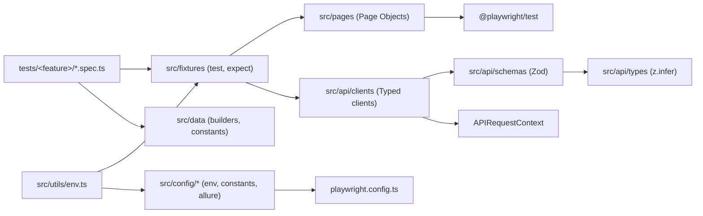

<h1 align="center">playwright-ts-e2e-template</h1>

<p align="center">
  <em>Production-grade Playwright + TypeScript E2E template — multi-env, Allure, GitHub Actions CI/CD, strict QA conventions.</em><br/>
  <em>Clone, change the URLs, write specs. Under five minutes from <code>git clone</code> to the first green run.</em>
</p>

<p align="center">
  <a href="https://github.com/victorberthodev/playwright-ts-e2e-template/actions/workflows/ci.yml"></a>
  <a href="https://github.com/victorberthodev/playwright-ts-e2e-template/actions/workflows/nightly.yml"></a>
  <a href="https://victorberthodev.github.io/playwright-ts-e2e-template/"></a>
  <a href="LICENSE"></a>
</p>

<p align="center">
  <a href="https://playwright.dev/"></a>
  <a href="tsconfig.json"></a>
  <a href="https://pnpm.io/"></a>
  <a href="https://nodejs.org/"></a>
  <a href="https://www.conventionalcommits.org/"></a>
  <a href="https://github.com/conventional-changelog/commitlint"></a>
</p>

---

## Highlights

- ⚡ **Five-minute setup** — `clone → pnpm install → pnpm exec playwright install chromium → pnpm test:smoke`.
- 🧩 **Strict TypeScript** — `strict`, `noUncheckedIndexedAccess`, `exactOptionalPropertyTypes`, path alias `@/*`.
- 🎭 **POM that scales** — composition over inheritance, typed `Locator` getters, ESLint forbids assertions inside page objects.
- 🌐 **Multi-environment** — `dev`/`stg`/`prd` switched by `TEST_ENV`, validated by Zod, cross-platform (bash + PowerShell).
- 🔐 **Auth via setup project** — `playwright/.auth/*.json` storage state generated once per run, never committed.
- 🧪 **Two API patterns** — typed client with Zod schema validation + hybrid spec (API seed → UI validation).
- 📊 **Allure out of the box** — categories, environment widget, failure-only `final-url` + `viewport-html` attachments.
- 🤖 **Three GitHub Actions workflows** — PR CI matrix (chromium/firefox/webkit), nightly regression with auto-issue on failure, gh-pages Allure deploy with history merge.
- 🔒 **Quality gates locked in** — Husky `pre-commit` (lint-staged) + `commit-msg` (commitlint), forbids `waitForTimeout`, `no-explicit-any`, focused tests.

---

<details open>
<summary><strong>🇧🇷 Português</strong></summary>

## Sumário

1. [Por que este template](#por-que-este-template)
2. [Stack](#stack)
3. [Arquitetura](#arquitetura)
4. [Quick Start](#quick-start)
5. [Configuração de ambientes](#configuração-de-ambientes)
6. [Como rodar os testes](#como-rodar-os-testes)
7. [Estratégia de testes](#estratégia-de-testes)
8. [Tags e filtros](#tags-e-filtros)
9. [Relatórios](#relatórios)
10. [CI/CD](#cicd)
11. [Solução de problemas](#solução-de-problemas)
12. [Como contribuir](#como-contribuir)
13. [Licença](#licença)

## Por que este template

Frameworks de automação tendem a degradar rápido: seletores frágeis,
`waitForTimeout` espalhado, `any` por toda parte, sem isolamento de
dados, sem rastreabilidade quando o CI falha. Este template existe
para entregar — de saída — uma base que um QA sênior aprovaria sem
refactor: tipagem estrita, lint específico de Playwright, page
objects sem assertions, fixtures tipadas, validação de contratos com
Zod, relatórios Allure publicados em GitHub Pages e três workflows
GitHub Actions já cabeados.

Use como ponto de partida para um novo projeto de squad ou como
vitrine técnica em portfólio.

## Stack

| Camada            | Escolha                             | Versão alvo |
| ----------------- | ----------------------------------- | ----------- |
| Runtime           | Node.js                             | ≥ 20 LTS    |
| Package manager   | pnpm                                | 10.x        |
| Linguagem         | TypeScript                          | 5.x strict  |
| Test runner       | Playwright Test                     | 1.60+       |
| Reporter          | Allure + Playwright HTML            | 3.x         |
| Lint              | ESLint + `eslint-plugin-playwright` | 10.x        |
| Format            | Prettier                            | 3.x         |
| Git hooks         | Husky + lint-staged + commitlint    | latest      |
| CI/CD             | GitHub Actions                      | —           |
| Schema validation | Zod                                 | 4.x         |
| Data factory      | `@faker-js/faker`                   | 10.x        |

## Arquitetura



### Pastas

```
src/
├── api/
│   ├── clients/    # clients tipados (UsersClient...)
│   ├── schemas/    # Zod schemas — fonte de verdade dos contratos
│   └── types/      # DTOs derivados via z.infer
├── pages/          # Page Objects (BasePage abstrata + concretas)
├── fixtures/       # mergeTests com page + api fixtures
├── data/
│   ├── builders/   # builders com faker (UserBuilder)
│   └── *.data.ts   # constantes do domínio (usuários, produtos)
├── utils/          # env loader (zod), step() logger
└── config/         # environments, constants, allure config
tests/
├── *.setup.ts      # rodam no projeto "setup" — geram storageState
├── ui/             # specs de UI por feature
├── api/            # specs de API
└── hybrid/         # API setup + UI validation
playwright/.auth/   # storageState gerado (gitignored)
```

## Quick Start

```bash
git clone https://github.com/victorberthodev/playwright-ts-e2e-template.git
cd playwright-ts-e2e-template
pnpm install
pnpm exec playwright install chromium
pnpm test:smoke
```

Saída esperada: 4–5 testes verdes em ~10s.

> **Windows**: comandos funcionam idênticos em PowerShell e Git Bash.
> Husky configura hooks automaticamente no `pnpm install`.

## Configuração de ambientes

Três ambientes via `TEST_ENV`: `dev` (default), `stg`, `prd`.

```bash
# bash / zsh
TEST_ENV=stg pnpm test

# PowerShell
$env:TEST_ENV='stg'; pnpm test
```

Defaults vivem em [`src/config/environments.ts`](src/config/environments.ts).
Para customizar URLs, copie os exemplos:

```bash
cp .env.example .env
cp .env.dev.example .env.dev
cp .env.stg.example .env.stg
cp .env.prd.example .env.prd
```

`src/utils/env.ts` carrega `.env` + `.env.${TEST_ENV}` e valida com
Zod — falha rápido se faltar variável obrigatória.

## Como rodar os testes

| Comando                 | O que faz                         |
| ----------------------- | --------------------------------- |
| `pnpm test`             | Todos os projects                 |
| `pnpm test:smoke`       | Apenas `@smoke` (rápido)          |
| `pnpm test:regression`  | Apenas `@regression`              |
| `pnpm test:ui`          | UI em chromium + firefox + webkit |
| `pnpm test:ui:chromium` | UI só chromium                    |
| `pnpm test:api`         | API project (sem browser)         |
| `pnpm test:headed`      | UI com browser visível            |
| `pnpm test:debug`       | Playwright Inspector              |
| `pnpm test:list`        | Lista testes sem executar         |
| `pnpm test:report`      | `allure serve allure-results`     |

Filtros adicionais aceitos pelo Playwright funcionam normalmente:

```bash
pnpm test --grep @auth
pnpm test --project=ui-firefox tests/ui/inventory
pnpm test --workers=1 --headed
```

## Estratégia de testes

```
        ┌─────────────────────────────────┐
        │ E2E (cart/checkout-flow.spec)   │  ← jornadas completas
        ├─────────────────────────────────┤
        │ Hybrid (API seed → UI assert)   │  ← integração entre camadas
        ├─────────────────────────────────┤
        │ UI integration (login, sort)    │  ← features isoladas
        ├─────────────────────────────────┤
        │ API contract (zod schemas)      │  ← validação de payload
        └─────────────────────────────────┘
```

- **Prioridade de seletor** (Constitution C1): `getByRole` →
  `getByLabel` → `getByTestId` → `getByText`. Sem XPath, sem classes
  geradas.
- **Web-first only**: `toHaveText`, `toBeVisible`, `expect.poll`.
  ESLint bloqueia `waitForTimeout`.
- **Isolamento por teste**: cada teste cria e descarta seu próprio
  estado. `test.describe.serial` requer justificativa via JSDoc.
- **POM sem assertions**: enforced por `no-restricted-syntax` em
  `src/pages/**`.

## Tags e filtros

Tags inline em metadata, nunca no nome:

```ts
test(
  'logs in with valid credentials',
  { tag: ['@smoke', '@auth'] },
  async ({ loginPage, page }) => {
    /* ... */
  },
);
```

Tags em uso: `@smoke`, `@regression`, `@e2e`, `@api`, `@ui`,
`@auth`, `@inventory`, `@hybrid`.

## Relatórios

- **Allure local**: `pnpm test && pnpm test:report` → serve em
  `http://localhost:port` automaticamente.
- **Allure publicado**: workflow `publish-report.yml` faz deploy em
  `gh-pages` após cada push em `main`. URL:
  [https://victorberthodev.github.io/playwright-ts-e2e-template/](https://victorberthodev.github.io/playwright-ts-e2e-template/)
- **Playwright HTML fallback**: gerado em `playwright-report/` em
  toda execução.
- **Em falha**: trace + screenshot + video (retain-on-failure) +
  attachments custom (`final-url`, `viewport-html`) ficam no Allure
  - workflow artifact.

## CI/CD

Três workflows em `.github/workflows/`:

| Workflow             | Trigger                   | O que faz                                                           |
| -------------------- | ------------------------- | ------------------------------------------------------------------- |
| `ci.yml`             | PR + push `main`          | lint → API → UI matrix (chromium/firefox/webkit). Allure artifact.  |
| `publish-report.yml` | Push `main` + manual      | Regression chromium + API. Merge histórico Allure. Deploy gh-pages. |
| `nightly.yml`        | Cron `0 3 * * *` + manual | Regression matrix completa. Abre issue automática se falhar.        |

Cache de browsers Playwright (`~/.cache/ms-playwright`) por versão.
Dependabot configurado: npm semanal (grupos `playwright`, `eslint`,
`typescript`) + github-actions semanal.

## Solução de problemas

| Sintoma                                        | Causa provável / solução                                                                      |
| ---------------------------------------------- | --------------------------------------------------------------------------------------------- |
| `browserType.launch: Executable doesn't exist` | Browsers não instalados. `pnpm exec playwright install chromium` (ou `--with-deps` no Linux). |
| `Error: missing TEST_ENV variable`             | Faltou copiar `.env.dev.example` → `.env.dev`, ou variável obrigatória sem default no schema. |
| `husky - commit-msg script failed`             | Mensagem fora do padrão Conventional Commits. Ver [CONTRIBUTING.md](./CONTRIBUTING.md).       |
| `playwright/no-wait-for-timeout` no lint       | Use `await locator.waitFor()` ou `expect.poll`, nunca `page.waitForTimeout()`.                |
| CI falha em "Expected branch to be up to date" | `git pull --rebase origin main` antes de re-pushar.                                           |
| Allure não mostra "trend" no gh-pages          | Primeiro deploy não tem histórico ainda; aparece a partir do segundo run em `main`.           |

## Como contribuir

Consulte [CONTRIBUTING.md](./CONTRIBUTING.md). Resumo:

- Branch prefixes: `feat/`, `fix/`, `chore/`, `docs/`, `ci/`, `test/`, `refactor/`.
- Conventional Commits enforced por commitlint.
- Sempre importe `test` e `expect` de `@/fixtures`.
- Constitution em [CLAUDE.md](./CLAUDE.md) é não-negociável — leia antes do primeiro PR.

## Licença

[MIT](./LICENSE) © 2026 Victor Bertho.

</details>

---

<details>
<summary><strong>🇬🇧 English</strong></summary>

## Table of contents

1. [Why this template](#why-this-template)
2. [Stack](#stack-1)
3. [Architecture](#architecture)
4. [Quick Start](#quick-start-1)
5. [Environment configuration](#environment-configuration)
6. [Running tests](#running-tests)
7. [Testing strategy](#testing-strategy)
8. [Tags and filters](#tags-and-filters)
9. [Reports](#reports)
10. [CI/CD](#cicd-1)
11. [Troubleshooting](#troubleshooting)
12. [Contributing](#contributing)
13. [License](#license)

## Why this template

Automation frameworks decay fast: brittle selectors, `waitForTimeout`
everywhere, sprinkled `any`, no data isolation, no traceability when
CI fails. This template ships a baseline a senior QA would approve
without refactor: strict typing, Playwright-aware lint, Page Objects
without assertions, typed fixtures, Zod-validated API contracts,
Allure reports published to GitHub Pages, and three GitHub Actions
workflows already wired.

Use it as the starting point for a squad's new project, or as a
technical portfolio piece.

## Stack

| Layer             | Choice                              | Target version |
| ----------------- | ----------------------------------- | -------------- |
| Runtime           | Node.js                             | ≥ 20 LTS       |
| Package manager   | pnpm                                | 10.x           |
| Language          | TypeScript                          | 5.x strict     |
| Test runner       | Playwright Test                     | 1.60+          |
| Reporter          | Allure + Playwright HTML            | 3.x            |
| Lint              | ESLint + `eslint-plugin-playwright` | 10.x           |
| Format            | Prettier                            | 3.x            |
| Git hooks         | Husky + lint-staged + commitlint    | latest         |
| CI/CD             | GitHub Actions                      | —              |
| Schema validation | Zod                                 | 4.x            |
| Data factory      | `@faker-js/faker`                   | 10.x           |

## Architecture


### Folder layout

```
src/
├── api/
│   ├── clients/    # typed clients (UsersClient...)
│   ├── schemas/    # Zod schemas — single source of truth
│   └── types/      # DTOs inferred via z.infer
├── pages/          # Page Objects (abstract BasePage + concrete)
├── fixtures/       # mergeTests with page + api fixtures
├── data/
│   ├── builders/   # faker-backed builders (UserBuilder)
│   └── *.data.ts   # domain constants (users, products)
├── utils/          # env loader (zod), step() logger
└── config/         # environments, constants, allure config
tests/
├── *.setup.ts      # run in the "setup" project — generate storageState
├── ui/             # UI specs by feature
├── api/            # API specs
└── hybrid/         # API setup + UI validation
playwright/.auth/   # generated storageState (gitignored)
```

## Quick Start

```bash
git clone https://github.com/victorberthodev/playwright-ts-e2e-template.git
cd playwright-ts-e2e-template
pnpm install
pnpm exec playwright install chromium
pnpm test:smoke
```

Expected output: 4–5 green tests in ~10s.

> **Windows**: commands work identically in PowerShell and Git Bash.
> Husky wires the git hooks on `pnpm install`.

## Environment configuration

Three environments via `TEST_ENV`: `dev` (default), `stg`, `prd`.

```bash
# bash / zsh
TEST_ENV=stg pnpm test

# PowerShell
$env:TEST_ENV='stg'; pnpm test
```

Defaults live in [`src/config/environments.ts`](src/config/environments.ts).
To customize URLs, copy the examples:

```bash
cp .env.example .env
cp .env.dev.example .env.dev
cp .env.stg.example .env.stg
cp .env.prd.example .env.prd
```

`src/utils/env.ts` loads `.env` + `.env.${TEST_ENV}` and validates
with Zod — fails fast if a required variable is missing.

## Running tests

| Command                 | What it does                      |
| ----------------------- | --------------------------------- |
| `pnpm test`             | All projects                      |
| `pnpm test:smoke`       | `@smoke` only (fast)              |
| `pnpm test:regression`  | `@regression` only                |
| `pnpm test:ui`          | UI on chromium + firefox + webkit |
| `pnpm test:ui:chromium` | UI on chromium only               |
| `pnpm test:api`         | API project (no browser)          |
| `pnpm test:headed`      | UI with visible browser           |
| `pnpm test:debug`       | Playwright Inspector              |
| `pnpm test:list`        | List tests without running        |
| `pnpm test:report`      | `allure serve allure-results`     |

Extra Playwright filters work as expected:

```bash
pnpm test --grep @auth
pnpm test --project=ui-firefox tests/ui/inventory
pnpm test --workers=1 --headed
```

## Testing strategy

```
        ┌─────────────────────────────────┐
        │ E2E (cart/checkout-flow.spec)   │  ← full journeys
        ├─────────────────────────────────┤
        │ Hybrid (API seed → UI assert)   │  ← cross-layer integration
        ├─────────────────────────────────┤
        │ UI integration (login, sort)    │  ← isolated features
        ├─────────────────────────────────┤
        │ API contract (zod schemas)      │  ← payload validation
        └─────────────────────────────────┘
```

- **Selector priority** (Constitution C1): `getByRole` → `getByLabel`
  → `getByTestId` → `getByText`. No XPath, no generated classes.
- **Web-first only**: `toHaveText`, `toBeVisible`, `expect.poll`.
  ESLint blocks `waitForTimeout`.
- **Per-test isolation**: every test owns its state.
  `test.describe.serial` requires a JSDoc justification.
- **POM without assertions**: enforced by `no-restricted-syntax` in
  `src/pages/**`.

## Tags and filters

Tags inline in metadata, never in the name:

```ts
test(
  'logs in with valid credentials',
  { tag: ['@smoke', '@auth'] },
  async ({ loginPage, page }) => {
    /* ... */
  },
);
```

In use: `@smoke`, `@regression`, `@e2e`, `@api`, `@ui`, `@auth`,
`@inventory`, `@hybrid`.

## Reports

- **Local Allure**: `pnpm test && pnpm test:report` → serves on
  `http://localhost:port` automatically.
- **Published Allure**: `publish-report.yml` deploys to `gh-pages`
  after every push to `main`. URL:
  [https://victorberthodev.github.io/playwright-ts-e2e-template/](https://victorberthodev.github.io/playwright-ts-e2e-template/)
- **Playwright HTML fallback**: generated in `playwright-report/` on
  every run.
- **On failure**: trace + screenshot + video (retain-on-failure) +
  custom attachments (`final-url`, `viewport-html`) land in Allure
  - as workflow artifacts.

## CI/CD

Three workflows in `.github/workflows/`:

| Workflow             | Trigger                   | What it does                                                           |
| -------------------- | ------------------------- | ---------------------------------------------------------------------- |
| `ci.yml`             | PR + push to `main`       | lint → API → UI matrix (chromium/firefox/webkit). Allure artifact.     |
| `publish-report.yml` | Push to `main` + manual   | Regression chromium + API. Merges Allure history. Deploys to gh-pages. |
| `nightly.yml`        | Cron `0 3 * * *` + manual | Full regression matrix. Opens an issue automatically on failure.       |

Playwright browser cache (`~/.cache/ms-playwright`) keyed by version.
Dependabot is configured: npm weekly (groups for `playwright`,
`eslint`, `typescript`) + github-actions weekly.

## Troubleshooting

| Symptom                                          | Likely cause / fix                                                                            |
| ------------------------------------------------ | --------------------------------------------------------------------------------------------- |
| `browserType.launch: Executable doesn't exist`   | Browsers not installed. `pnpm exec playwright install chromium` (or `--with-deps` on Linux).  |
| `Error: missing TEST_ENV variable`               | Forgot to copy `.env.dev.example` → `.env.dev`, or a required env var lacks a schema default. |
| `husky - commit-msg script failed`               | Message not Conventional Commits. See [CONTRIBUTING.md](./CONTRIBUTING.md).                   |
| `playwright/no-wait-for-timeout` lint error      | Use `await locator.waitFor()` or `expect.poll`, never `page.waitForTimeout()`.                |
| CI fails with "Expected branch to be up to date" | `git pull --rebase origin main` before re-pushing.                                            |
| Allure shows no "trend" on gh-pages              | First deploy has no history yet; trend appears starting from the second `main` run.           |

## Contributing

See [CONTRIBUTING.md](./CONTRIBUTING.md). Quick summary:

- Branch prefixes: `feat/`, `fix/`, `chore/`, `docs/`, `ci/`, `test/`, `refactor/`.
- Conventional Commits enforced by commitlint.
- Always import `test` and `expect` from `@/fixtures`.
- The Constitution in [CLAUDE.md](./CLAUDE.md) is non-negotiable —
  read it before your first PR.

## License

[MIT](./LICENSE) © 2026 Victor Bertho.

</details>

---

## Acknowledgements

Built on top of excellent open-source projects:

- [Playwright](https://playwright.dev/) by Microsoft
- [Allure](https://allurereport.org/) by Qameta Software
- [Zod](https://zod.dev/) by Colin McDonnell
- [Faker](https://fakerjs.dev/)
- [SauceDemo](https://www.saucedemo.com/) by Sauce Labs — public sample UI
- [JSONPlaceholder](https://jsonplaceholder.typicode.com/) by Typicode — public sample API
